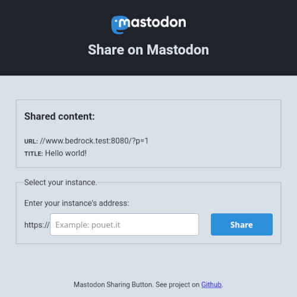

# Mastodon Sharing Button

 

An alternative to [Mastodon Share Button](https://aly-ve.github.io/Mastodon-share-button/) in PHP.

## Introduction

I like Javascript, but sometimes I want to provide features that do not require script activation. Some people use extensions to deactivate them by default on new website. I am one of them and I don't want to activate scripts on each website I visit.

So, the [Mastodon Share Button](https://aly-ve.github.io/Mastodon-share-button/) is a good option if your app already requires Javascript. If not, this project is an alternative.

You can add a Mastodon button to your website without the need of Javascript. A pop up will open to let the user choose its instance.

## Install

Download this repo, unzip it and place the folder inside your project. Now, you need to configure it. Everything is set inside the `config.php` file:

- A token key
- An existing path to cache the list instance
- A default locale

The token key is used to call the Mastodon API and retrieve the instances list. I don't provide this token key but you can generate it on [instances.social](https://instances.social/api/token).

Instead of calling the API each time an user click on the button, the instance list is cached inside a PHP file. You need to provide an existing path and a filename (or you can leave the one set by default but you need to create the `cache` folder).

You can also change the default locale. This parameter is used if no translation exists for the user accepted locales. Currently, only English and French are available.

## Usage

Make a link to `mastodon-sharing-button/select-instance.php` with title and url parameters.

Example:

```
https://www.yourwebsite.com/mastodon-sharing-button/select-instance.php?title=Your%20%Awesome%20%Article&url=https://www.yourwebsite.com/your-awesome-article/
```

When the user click on the link, a popup is opened to let him choose an instance. Only instances available from the API and not down are valid. These instances are suggested on type and via the (random) placeholder.

Once the user types its instance URL and clicks on "_Share_", he is redirected to its instance with the pre-filled field.



## Contributing

Any PR are welcome to improve this project whether it be to improve the code or to provide other translations.

## License

This project is open source and available under the [MIT License](https://github.com/ArmandPhilippot/mastodon-sharing-button/blob/master/LICENSE).
